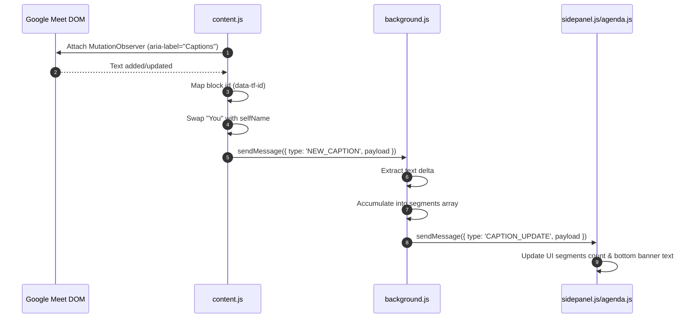
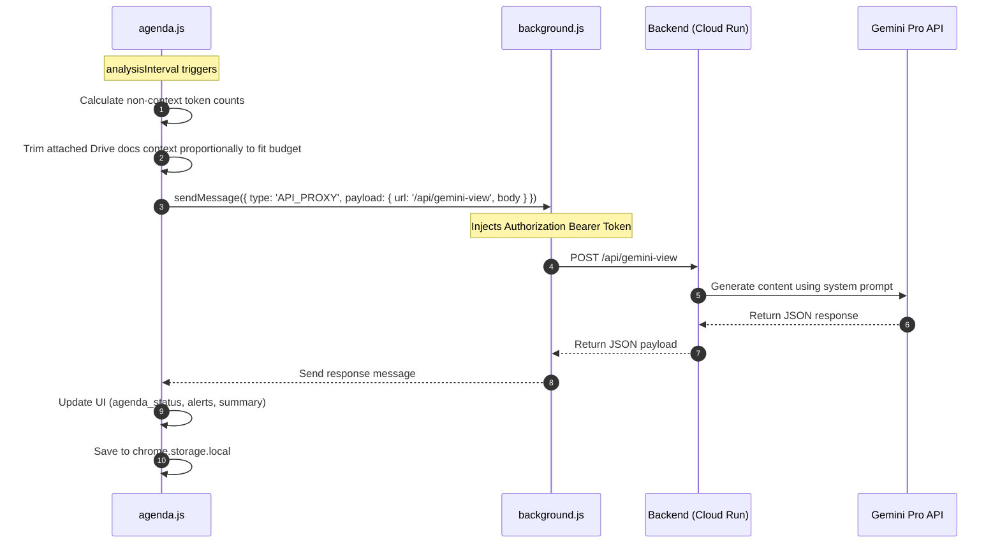

# ThoughtForm Chrome Extension Architecture & Technical Walkthrough

This document provides a concise, developer-centric guide to the design and implementation of the ThoughtForm Chrome Extension. It is structured to help future developers (and agentic AI assistants) quickly locate code, understand the interactions between components, and make changes efficiently.

---

## 📂 File Directory Map

The extension is located under `sureskumar/chrome_ext_sidebar/` and contains the following files:

| File Name | Role | Primary Responsibility |
| :--- | :--- | :--- |
| [manifest.json](file:///usr/local/google/home/sureskumar/corp/thoughtform-project/sureskumar/chrome_ext_sidebar/manifest.json) | Configuration | Extension configuration (Manifest V3), permissions, oauth scopes, content scripts, and page declarations. |
| [background.js](file:///usr/local/google/home/sureskumar/corp/thoughtform-project/sureskumar/chrome_ext_sidebar/background.js) | Service Worker | Central state accumulator (transcript, participants), meeting ID URL router, CORS proxy for backend API calls, and external app port coordinator. |
| [content.js](file:///usr/local/google/home/sureskumar/corp/thoughtform-project/sureskumar/chrome_ext_sidebar/content.js) | Content Script | Runs in `meet.google.com` tabs. Scrapes captions and attendee lists from the DOM, resolves "You" to the user's name, and sends updates to the background worker. |
| [auth.js](file:///usr/local/google/home/sureskumar/corp/thoughtform-project/sureskumar/chrome_ext_sidebar/auth.js) | Module | Handles Google OAuth login, silent token refresh, scope verification, and session expiration signaling. |
| [sidepanel.html](file:///usr/local/google/home/sureskumar/corp/thoughtform-project/sureskumar/chrome_ext_sidebar/sidepanel.html) | View | The main sidebar shell HTML. Declares the login view, iframe container, floating control toolbar, and overflow settings menu. |
| [sidepanel.js](file:///usr/local/google/home/sureskumar/corp/thoughtform-project/sureskumar/chrome_ext_sidebar/sidepanel.js) | Controller | Sidebar controller. Manages iframe page routing (login vs agenda), postMessage bridge between iframe pages, zoom level, toolbar buttons, and context files icon state (grey/pulsing/blue) + hover popup. |
| [meetings.html](file:///usr/local/google/home/sureskumar/corp/thoughtform-project/sureskumar/chrome_ext_sidebar/meetings.html) | View | Calendar & document prep screen loaded in the sidebar iframe. |
| [meetings.js](file:///usr/local/google/home/sureskumar/corp/thoughtform-project/sureskumar/chrome_ext_sidebar/meetings.js) | Controller | Queries Google Calendar events, searches Drive for matching notes, exports workspace documents to plain text, and packs the session context. Note: the meetings page is no longer the default landing — the user is routed directly to the agenda page. |
| [meetings.css](file:///usr/local/google/home/sureskumar/corp/thoughtform-project/sureskumar/chrome_ext_sidebar/meetings.css) | Styling | Google-inspired styling, loading indicators, check-boxes, and transitions for the meetings picker view. |
| [agenda.html](file:///usr/local/google/home/sureskumar/corp/thoughtform-project/sureskumar/chrome_ext_sidebar/agenda.html) | View | Live agenda progress page loaded in the sidebar iframe. |
| [agenda.js](file:///usr/local/google/home/sureskumar/corp/thoughtform-project/sureskumar/chrome_ext_sidebar/agenda.js) | Controller | Triggers Gemini API analysis loop, renders agenda statuses, computes inline timelines/needles, periodically syncs state to Cloud Run and Firestore, and auto-fetches past meeting notes from Drive as context (last 3 docs). |
| [agenda.css](file:///usr/local/google/home/sureskumar/corp/thoughtform-project/sureskumar/chrome_ext_sidebar/agenda.css) | Styling | CSS variables, layout, animations (listening/analyzing pulses), timeline needle, and progress badges. |
| [experiment.html](file:///usr/local/google/home/sureskumar/corp/thoughtform-project/sureskumar/chrome_ext_sidebar/experiment.html) | View | Full tab view for developer debugging. |
| [experiment.js](file:///usr/local/google/home/sureskumar/corp/thoughtform-project/sureskumar/chrome_ext_sidebar/experiment.js) | Controller | Renders raw transcript segments and active participant list in real-time. |
| [tailwind.js](file:///usr/local/google/home/sureskumar/corp/thoughtform-project/sureskumar/chrome_ext_sidebar/tailwind.js) | Library | Local Tailwind compilation script used in views for general utilities. |

---

## ⚙️ Architecture & Data Flows

### 1. Caption Capturing & Parsing Flow

### 2. Live Agenda Analysis Flow (Every 15 Seconds)

### 3. Session Synchronization Flow (Every 5 & 30 Seconds)
* **Every 5 Seconds**: `agenda.js` pushes the current state (`agendaStatus`, `timekeepingAlert`, `summary`, elapsed, etc.) via `POST /api/session` so users visiting the shared URL on the web app can watch progress live.
* **Every 30 Seconds**: `agenda.js` persists a complete transcript history and event context to Firestore via `POST /api/ext/meetings`.

---

## 🔑 Shared Local Storage Map

The extension uses `chrome.storage.local` to share state and keep the user interface in sync.

| Storage Key | Data Type | Description |
| :--- | :--- | :--- |
| `tf_user` | `object` | Signed-in user profile `{ uid, email, name, photoUrl }`. |
| `tf_access_token` | `string` | Google OAuth access token. |
| `tf_token_expiry` | `number` | Expiration timestamp (epoch milliseconds) of the access token. |
| `tf_granted_scopes`| `string[]`| Unified list of permissions currently granted. |
| `currentMeetingId` | `string` | Google Meet identifier (e.g. `abc-defg-hij`) parsed from the tab URL. |
| `captureEnabled` | `boolean` | Global toggle. Determines if Meet tab should click CC button and parse captions. |
| `meetingContext` | `object` | Event details + Drive document bodies packed during the prep view. |
| `sessionId` | `string` | UUID generated for the active meeting tracking session. |
| `sessionStartTime`| `number` | Epoch milliseconds when the play/resume button was started. |
| `isRunning` | `boolean` | Active state of the meeting progress tracker. |
| `shareUrl` | `string` | Public web client viewer URL for the active session. |
| `panelZoom` | `number` | Saved zoom multiplier for the sidebar document tree. |
| `lastAgendaStatus`| `object[]` | Cached agenda data. Prevents page flashes on sidebar close/reopen. |
| `lastTimekeepingAlert`| `string` | Cached timekeeping alert text. |
| `lastSummary` | `string` | Cached insight summary text. |

---

## ✉️ Chrome Runtime IPC Message Inventory

Extension scripts communicate internally using `chrome.runtime.sendMessage` and `chrome.runtime.onMessage.addListener`.

| Message Type | Sender | Recipient | Payload | Purpose |
| :--- | :--- | :--- | :--- | :--- |
| `NEW_CAPTION` | `content.js` | `background.js` | `{ speaker, caption, timestamp, blockId, isNewBlock }` | Delivers a raw caption update. |
| `CAPTION_UPDATE` | `background.js` | `agenda.js` / `experiment.js` | `{ currentSegment, allSegments, isNewSegment }` | Broadcasts accumulated transcript segments. |
| `PARTICIPANTS_UPDATE` | `content.js` / `background.js` | `background.js` / `agenda.js` / `experiment.js` | `{ count, names, selfName }` | Syncs active meeting participants. |
| `GET_PARTICIPANTS` | `agenda.js` / `experiment.js` | `background.js` | *None* | Requests current attendee list. |
| `GET_SEGMENTS` | `agenda.js` / `sidepanel.js` / `experiment.js` | `background.js` | *None* | Requests current transcript segments array. |
| `GET_MEETING_ID` | `agenda.js` | `background.js` | *None* | Requests active Google Meet code. |
| `CLEAR_SEGMENTS` | `sidepanel.js` | `background.js` | *None* | Triggers reset of background transcript data. |
| `SEGMENTS_CLEARED` | `background.js` | `agenda.js` / `experiment.js` | *None* | Signals views to wipe transcript displays. |
| `CAPTURE_STATE_CHANGED` | `sidepanel.js` / `agenda.js` | `content.js` | `{ enabled }` | Enables/disables DOM caption listeners. |
| `RESET_TRANSCRIPT_STATE` | `sidepanel.js` | `content.js` | *None* | Triggers content script DOM state flush. |
| `MEETING_CHANGED` | `background.js` | `agenda.js` | `{ oldMeetingId, newMeetingId }` | Auto-stops running session on url change. |
| `API_PROXY` | `agenda.js` | `background.js` | `{ url, method, headers, body }` | Bypasses CORS by routing API calls through the worker. |
| `OPEN_EXPERIMENT` | `experiment.js` | `background.js` | *None* | Requests worker to launch transcript debug tab. |

---

## 🔀 Window postMessage Router (Iframe Bridge)

Since page files are running in an iframe inside the sidepanel page context, they coordinate layout and navigation by posting messages to `window.parent`:

| Message Type | Sender | Recipient | Payload | Purpose |
| :--- | :--- | :--- | :--- | :--- |
| `NAVIGATE_TO_AGENDA` | `meetings.js` | `sidepanel.js` | *None* | Routes sidebar frame to `agenda.html`. |
| `NAVIGATE_TO_MEETINGS` | `agenda.js` | `sidepanel.js` | *None* | Routes sidebar frame back to `meetings.html`. |
| `SESSION_EXPIRED` | `auth.js` | `sidepanel.js` | *None* | Signals silent login failure; opens login view. |
| `ANALYZING_STATE` | `agenda.js` | `sidepanel.js` | `{ active }` | Controls the pulsing blue dot in the toolbar. |
| `DATE_LABEL_UPDATED` | `meetings.js` | `sidepanel.js` | `{ label }` | Syncs current calendar date label to overflow menu. |
| `CONTEXT_STATE` | `agenda.js` | `sidepanel.js` | `{ state: { status, files[] } }` | Updates the context files icon state (idle/fetching/loaded) and populates the hover popup. |
| `TOGGLE_SESSION` | `sidepanel.js` | `agenda.js` | *None* | Passes play/pause toolbar clicks into live loop. |
| `NAVIGATE_DATE` | `sidepanel.js` | `meetings.js` | `{ direction }` (`'prev'` \| `'next'` \| `'today'`) | Propagates date picker navigation into meetings list. |
| `REMOVE_CONTEXT_FILE` | `sidepanel.js` | `agenda.js` | `{ index, fileId }` | Removes a specific context file when user clicks × in the hover popup. |

---

## 🛠️ Dev Tips & Gotchas
1. **Bypassing CORS**: The backend APIs run behind configurations that restrict CORS options preflights. Direct requests from `agenda.js` or `meetings.js` will fail. **Always use the background page as a proxy** via `proxyFetch` in `agenda.js` or through `auth.js`.
2. **Standard "You" Replacement**: If captions aren't identifying the speaker correctly for the local user, look at the `findSelfName` function in `content.js`. Meet's DOM frequently changes class selectors.
3. **Implicit Auth & Consent Flow**: Google OAuth uses `launchWebAuthFlow` implicit routing (returns `access_token` in redirection hash). Silent re-auth is done via an invisible prompt request (`prompt=none`). If the user revokes scopes, this call throws an error, prompting the application to execute a complete `auth.signOut()` sequence.
4. **Token Budget Boundaries**: Prompt context sizes are limited to prevent overloading. Drive context files are concatenated and proportionally sliced down to fit under `MAX_INPUT_CHARS` (calculated from model limits minus prompt overhead).
